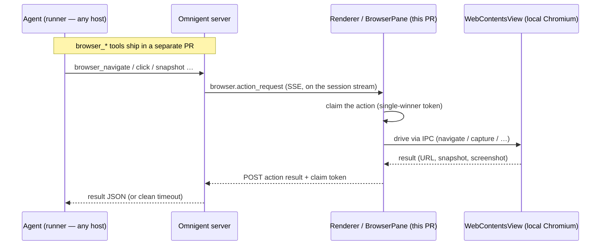

# Omnigent Desktop (Electron)

A thin [Electron](https://www.electronjs.org) desktop shell around the
existing Omnigent web UI. It shows the **same** UI you get in a browser, but
adds native niceties:

- **OS-native desktop notifications** (via the main-process `Notification`
  API) when an agent finishes a turn (`running` → `idle`/`failed`), raises a
  new elicitation (asks for input), or a runner disconnects (`online` →
  `offline`). A notification fires for any such event **except** the one
  conversation you're actively viewing (window focused _and_ that chat
  open). Sessions already settled at launch don't fire; only fresh
  transitions this client observes do. On a turn-end the notification body
  shows the **first few lines of the agent's final message** when they can be
  fetched (one best-effort `GET /items` call), falling back to a generic
  "Agent finished and is ready for your input." On macOS each notification can
  also **play a sound** — a system sound you pick in the **Notifications** menu
  (see below). It's **off by default (opt-in)**: a fresh install stays silent
  until you turn it on, so the sound never surprises you.
- **A foreground attention cue.** macOS (and Windows) suppress the notification
  _banner_ for the **frontmost** app — and macOS suppresses its **sound** too —
  so the notification still lands in Notification Center, but no toast pops (and
  on macOS no sound plays), which reads as "notifications only work when the app
  is in the background." Because the web layer already only notifies for
  sessions you are _not_ actively viewing, the shell adds OS-level cues the
  frontmost app _can_ produce: it **bounces the macOS dock icon** (or flashes
  the taskbar frame on Windows/Linux), and on macOS it **plays the chosen sound
  itself** (via `afplay`) instead of the suppressed notification sound. Because
  the shell plays it, the alert is audible **whether Omnigent is backgrounded or
  in front** — and the toast's own sound is muted so the cue never doubles.
- **Multiple windows** (**Server → New Window**, `Cmd/Ctrl+N`). Each window is
  an independent view, opening on the current window's URL so you can then
  navigate it to a different conversation and watch two side by side. A
  window can also be opened against a **different server** (see "Multiple
  servers" below). Notifications and the dock badge are app-wide (one badge
  for all windows); a notification click focuses the window that fired it.
- **macOS Managed Preferences for MDM-provided servers.** Administrators can
  publish an HTTPS `serverUrls` list in the `ai.omnigent.desktop` preference
  domain. The connect screen and in-app switcher show those choices under
  **Provided by your organization** without auto-connecting or preventing a
  manually entered server. See [Managed Preferences](docs/managed-preferences.md).
- **A dock / taskbar badge showing the number of unread sessions** at all
  times (macOS dock badge, Linux Unity launcher count, via
  `app.setBadgeCount`). A session becomes "unread" when it finishes a turn
  or asks for input while you're not actively viewing it, and is cleared the
  moment you view it. Runner disconnects notify but do **not** count toward
  the badge.
- **The standard native menu** (App / Edit / View / Window / Help) built from
  Electron's menu roles, so the usual text-editing shortcuts — Cmd/Ctrl-A,
  C, V, X, Z — work inside the webview's text fields. **Settings…** uses the
  native `Cmd+,` accelerator on macOS (`Ctrl+,` elsewhere) and routes the
  focused connected window through the SPA without reloading it. On macOS,
  **About Omnigent** opens a shell-owned modal showing the platform app and
  detected CLI versions; the CLI section points users to `omni update`.
  **Check for Updates…** in
  the Server menu opens the same modal and starts a check. **Update now** in the
  shell update prompt opens the modal, hides the prompt, and starts the download;
  the modal shows live progress and then offers **Restart to update**. Packaged macOS builds
  resolve the running app's native icon so the modal uses the current
  `Assets.car`/Liquid Glass appearance rather than the development PNG. Our other custom actions
  — **New Window**, **New Window on Different Server…**, and
  **Change Server…** — live in a dedicated **Server** submenu. On macOS a
  **Notifications** submenu turns the notification sound on/off (**Play
  Notification Sound**, **off by default** — the user opts in) and picks which
  macOS system sound to play (**Sound ▸** — Glass, Ping, Hero, …); choosing one
  previews it, and the choice persists in `settings.json` and applies to the
  next notification.
- **Browser-style file drag-and-drop** works out of the box: Electron does
  not intercept file drops the way Tauri does by default, so dropping an
  image onto a text field reaches the web app's HTML5 drop handler with no
  extra configuration.
- **Microphone permission for voice dictation.** The composer's dictation
  button uses the Web Speech API plus a `getUserMedia` audio stream (the mic
  level meter). Both go through Chromium's permission layer, which in Electron
  asks the _embedder_ (us) rather than showing Chrome's prompt — with no
  handler wired, Chromium denies by default, so `recognition.start()` fails
  instantly with `not-allowed` and the button appears dead. The main process
  now wires `setPermissionRequestHandler` / `setPermissionCheckHandler` to
  grant the audio permissions, and on macOS calls
  `systemPreferences.askForMediaAccess("microphone")` lazily — on the first
  actual mic request (the user clicking dictate), not at app startup — so the
  OS-level mic gate is open too (packaged builds ship
  `NSMicrophoneUsageDescription`).

  > **Caveat — Web Speech does not transcribe in Electron.** Granting the
  > mic clears the _permission_ gate, but `SpeechRecognition` also depends on
  > Google's cloud speech backend keyed to official Google Chrome builds, which
  > Electron's bundled Chromium does **not** ship. Electron therefore uses the
  > **server-side dictation fallback** instead: when the connected server has
  > the `dictation` extra and models installed (`GET /v1/info` reports
  > `dictation_available`), a take that fails with Web Speech's `network`
  > error falls back to streaming audio to `WS /v1/dictation/stream` and
  > transcribing on the server — no cloud, no Chrome dependency. See
  > `designs/server-dictation.md`. Without the server extra, the button still
  > renders (the constructor exists) but shows "Dictation unavailable" when
  > clicked, as before.

## How it works (zero UI duplication)

The desktop app does **not** ship a copy of the server web UI. It bundles small
shell-owned pages for connecting to a server and native utilities such as the
About modal. On launch:

1. If no server URL is saved yet, it shows the setup page (one input +
   Connect). You enter your Omnigent server URL (default
   `http://localhost:8000`).
2. It persists that URL to the per-user app data dir (`settings.json` under
   Electron's `userData` path) and **loads the server's own origin**, where
   the server serves the real SPA (the production `web` build, the same
   bytes a browser would load).
3. On subsequent launches it skips the setup page and loads the saved server
   directly.

If the saved server fails to load (server down, DNS failure, TLS error), the
window falls back to the setup page with the error shown and the failed URL
pre-filled — the saved URL is kept, so Connect simply retries it.

Entering a plain-`http://` URL for a **non-local** host shows a warning first
(anyone on the network path can act as that server); a second Connect click
proceeds. `http://localhost:8000` connects with no friction.

Change the server later via the **Server → Change Server…** menu item, which
clears the saved URL and returns the focused window to the setup page.

Open another view with **Server → New Window** (`Cmd/Ctrl+N`). It clones the
focused window's current URL onto a new window against the same server, so two
conversations can be watched at once.

## Databricks sign-in and embedded-auth rollback

HTTPS Databricks workspace and account URLs use **system-browser OAuth** by
default. Databricks Apps (`*.databricksapps.com`), localhost, and other servers
keep their existing authentication behavior; the workspace session bridge is
not used for them.

The desktop completes browser sign-in and creates a DBAUTH cookie before loading
the workspace. It renews the cookie before its known expiry and on cookie removal.
If the workspace rejects the session, login requests are blocked while the shell
tries silent renewal. Missing credentials, failed renewal, unavailable OAuth,
and cancellation lead to the shell's connect/retry screen—not embedded workspace
SSO. Failed connections stay blocked through the selector handoff so a late login
redirect cannot replace it. Connect reuses stored credentials and opens the
system browser only when they can't sign in. To use another account, choose
**Server → Sign Out of Server** (or **Sign out of <workspace>** in the server
picker at the bottom of the sidebar, on servers whose web app includes it): it
forgets the stored OAuth token, clears DBAUTH, and returns every window on that
workspace to the connect screen, so the next Connect signs in through the
browser. Saved-server launches, additional windows, server switches, and deep
links use stored credentials without opening a browser automatically.

When the workspace is briefly unreachable (a VPN reconnecting after wake, an IP
access list refusing this network, or HTTP 5xx/429), the window keeps its page
under a **Reconnecting to Databricks…** overlay and retries every 5s for a minute,
then every 10s for another. Cancel, or running out of retries, returns to the
setup page with the reason.

For the packaged macOS app, explicitly roll back to embedded Databricks sign-in:

```bash
# Quit Omnigent first, then set the preference and reopen it.
defaults write ai.omnigent.desktop DatabricksBrowserAuthEnabled -bool false
```

This selects the entire legacy lifecycle: no browser OAuth, no OAuth-based cookie
renewal, and the existing embedded login/return-banner behavior. It is not a
fallback after a browser-auth failure. The preference is read once per process;
restart the app after changing it. It does not delete saved credentials.

To restore browser authentication, quit Omnigent and remove the override:

```bash
defaults delete ai.omnigent.desktop DatabricksBrowserAuthEnabled
```

An explicit `-bool true` also enables browser authentication. Unset defaults and
non-macOS platforms use browser mode. Development Electron uses its own bundle's
NSUserDefaults domain, not the packaged app's `ai.omnigent.desktop` domain.

### Manual verification

The classic Connect screen shows a spinner with **Connecting…**, then
**Authenticating…** during browser OAuth. Its trailing **×** button cancels the
window's current attempt, closes the local callback listener/picker, and stops
pending authentication requests. The URL stays entered for retry; late responses
cannot navigate the window. The external browser tab may remain open—Cancel does
not sign you out of that browser. The experimental React selector is unchanged.

You can exercise the classic button states, cancel, and retry without Databricks
configuration:

```bash
node --test web/electron/test/setup_connect.test.js
node --test --test-name-pattern='interactive OAuth cancellation' web/electron/test/databricks-oauth.test.js
```

- Run `just electron-dev`, use **Server → Change Server…**, and connect to an
  OAuth-enabled Databricks test workspace. Complete system-browser sign-in and
  confirm the desktop opens Omnigent. Terminal output must include
  `databricks session: signed in to ...`; merely reaching a login page is not success.
- Before completing browser sign-in, click the trailing **×** beside
  **Authenticating…**. The form should immediately return to Connect with the
  same URL. Retry once and confirm that an old attempt cannot change the new
  attempt's loading state or navigate the window.
- Under **Debug → Authentication**, use **Simulate Session Expiry** to
  clear DBAUTH without forcing a page reload. The existing cookie lifecycle
  handles normal recovery in the background; it must not display workspace/IdP
  login or the return banner. Removal affects windows sharing that session.
- **Simulate OAuth Token Expiry** only marks the focused workspace's cached
  access token expired. It does not request a refresh or reload the page.
- **Invalidate Cached Refresh Token** removes the refresh token from that
  workspace's local cache. It leaves the access token intact, makes no request,
  and does not revoke the grant at Databricks.
- To exercise the sign-in-required path, invalidate the cached refresh token,
  expire the access token, then simulate session expiry. The first two actions
  do not force renewal; the last triggers normal recovery, which should return
  to the shell's Connect screen because no usable OAuth grant remains locally.
  Normal runtime renewal is unchanged. All three actions are dev-build-only;
  token actions require a connected Databricks workspace in browser-auth mode.
- Test unavailable OAuth and cancel the account workspace picker: the shell
  should offer Connect/retry without loading embedded SSO.
- Build with `just electron-build` and open the packaged app. Verify account-first
  sign-in shows a working workspace picker. Apply the macOS rollback preference,
  restart, and verify embedded sign-in works without opening the browser. Remove
  the preference and restart to verify browser-only behavior returns.

### Databricks authentication diagnostics

Run `just electron-dev` from a terminal and retain the `[omnigent] databricks`
lines. For a packaged build, launch the app's executable from a terminal to see
its stdout/stderr. No extra logging flag is required.

The logs identify the selected mode, public OAuth client ID, requested scopes,
whether a client secret is configured (not its value), token-exchange status,
account/workspace routing, bridge redirects, final response phase/status, and
cookie counts. Backend error codes and request IDs are included when available.
Tokens, cookie values, client secrets, authorization codes, PKCE verifiers, full
callback URLs, and raw response bodies are not logged. Token and account-API
requests never follow redirects, so a 3xx from those endpoints is reported as a
failure rather than carrying the grant or bearer to another destination. Workspace and client IDs
are still deployment metadata; redact those before sharing logs publicly.

- `bridge response` with `phase: 'session-create'` means the status came from
  `/auth/session/create` itself, before following a redirect.
- `phase: 'workspace landing'` means the bridge redirected and the status came
  from the destination page; it is not a rejection from the session-create endpoint.
- For a direct `403 PERMISSION_DENIED`, give the request ID and custom client ID
  to the Databricks platform owner to check the denial reason (client enablement,
  token scope, or workspace permissions). Do not infer the cause from status alone.

## OIDC sign-in through the system browser

Omnigent servers that sign in with OIDC (`OMNIGENT_AUTH_PROVIDER=oidc`) open
their identity provider in your **system browser**, not inside the app window.
Google sign-in (which rejects embedded browsers), passkeys, password managers,
and the browser's existing IdP session all work there.

Before loading a server, the shell reads its unauthenticated
`/.well-known/omnigent.json` manifest. Only `auth.mode: "oidc"` switches to
browser sign-in:

| Server                                                     | Sign-in                                         |
| ---------------------------------------------------------- | ----------------------------------------------- |
| OIDC                                                       | System browser (below)                          |
| Accounts (username + password)                             | Unchanged: the server's own form, in the window |
| Header mode, custom providers, no auth                     | Unchanged                                       |
| No `auth` in the manifest (older servers, subpath proxies) | Unchanged: in the window                        |
| Databricks workspaces, accounts, and Apps                  | Unchanged: detected by URL, manifest not read   |

- **Connect** opens the browser at the server's `/auth/login` with an RFC 8252
  loopback redirect (`http://127.0.0.1:<random port>/callback`) and a PKCE
  challenge. After you sign in, the server sends the browser back to that
  loopback with a one-time code, and the shell exchanges the code and its
  verifier at `POST /auth/native-token`. The code only reaches this machine and
  is useless without the verifier. The shell installs the returned session as
  the server's own session cookie, confirms `/v1/me` accepts it, and brings the
  window to the front. If the existing session is still valid, or the stored
  refresh grant renews it, Connect doesn't open the browser at all.
- **Launch, New Window, deep links, and server switches** reuse the session or
  renew it silently from the refresh grant (`POST /oauth/token`). They never
  open the browser. If nothing can renew it, the window returns to the connect
  screen with the reason (session expired, ended by the server, sign-in
  required).
- **While connected,** the shell renews the cookie before it expires and when it
  is removed. The web app's own redirect to `/auth/login` is stopped before it
  can reach the IdP; the shell renews and reloads the page you were on.
- **Sign out** (the web app's `/auth/logout`, **Server → Sign Out of Server**,
  or **Sign out of <server>** in the sidebar server picker) is handled by the shell: it revokes the refresh
  grant, clears the session cookie, and shows the connect screen for every
  window on that server. Your browser stays signed in to the
  IdP, so the next Connect may finish without a prompt.
- **Cancel** (the × beside **Authenticating…**) stops the attempt and the
  loopback listener. A browser tab that finishes later reaches nothing.

The refresh grant is stored per server in `~/.omnigent/oidc_tokens.json`,
encrypted with the OS keychain (`safeStorage`). Development builds also offer
**Debug → Authentication → Simulate Session Expiry** (clears the session cookie;
the lifecycle renews it) and **Invalidate Cached Refresh Token** for OIDC
windows.

### Manual verification

Run an OIDC server (for example `deploy/docker` with Keycloak, or any IdP whose
sign-in has a passkey step), then `just electron-dev`:

1. **Server → Change Server…**, enter the server URL, and select **Connect**.
   The setup page shows **Authenticating…**, your browser opens the IdP, and
   after sign-in the browser tab says "Return to Omnigent". The app comes to the
   front, signed in. The IdP page never appears inside the app.
2. Select the × during **Authenticating…**: the form returns to Connect. Retry
   works.
3. Quit and relaunch: the app opens signed in without a browser.
4. **Debug → Authentication → Simulate Session Expiry**: the app keeps working
   (the cookie is renewed silently).
5. **Invalidate Cached Refresh Token**, then **Simulate Session Expiry**, then
   reload: the connect screen says "Sign in to <host> to continue."
6. Sign out from the app's settings: the connect screen says "You're signed out
   of <host>." Relaunching doesn't sign you back in.
7. An accounts-mode server and `http://localhost:6767` (header mode) still sign
   in exactly as before.

## Debugging a packaged macOS build

Developer Tools are disabled by default in the production app. To opt in, quit
Omnigent, set its macOS user default, and reopen it:

```bash
defaults write ai.omnigent.desktop DeveloperMode -bool true
```

The packaged app then exposes **Debug → Authentication** session/token
simulations and **Debug → Developer Tools**. To turn production debugging off
again, quit Omnigent and remove the override:

```bash
defaults delete ai.omnigent.desktop DeveloperMode
```

Development (`pnpm --dir web/electron dev`) builds keep Developer Tools enabled
without this preference. The override is intentionally macOS-only and does not
relax production update security checks.

The native enhancements live on the web side in
[`../src/lib/nativeBridge.ts`](../src/lib/nativeBridge.ts). It detects the
Electron shell at runtime (the preload exposes `window.omnigentDesktop`
with `kind: "electron"`) and routes notifications/badge through the IPC
bridge; in a plain browser it falls back to the Web Notifications path. So the
one `web` bundle works both in a browser and under Electron.

## Architecture

```
electron/
  package.json             # Electron + electron-builder deps and build config
  src/main.js              # main process: window, settings, menu, IPC, badge, notify
  src/preload.js           # contextBridge: window.omnigentDesktop + omnigentSetup
  src/about_window.js      # shell-owned About modal + guarded update IPC
  src/about_preload.js     # narrow contextBridge for the About modal
  src/managed_preferences.js # read/validate macOS MDM server choices
  src/find_preload.js      # contextBridge for the find bar: window.omnigentFind
  src/browserViewRegistry.js  # per-conversation WebContentsView registry (browser pane)
  src/browserViewBounds.js    # CSS-px → window-DIP bounds conversion (browser pane)
  src/browserIpc.js           # omnigent:browser-* IPC handlers (extracted from main.js)
  src/loopback-oauth.js       # RFC 8252 loopback listener shared by browser sign-ins
  src/oidc-credentials.js     # OIDC loopback sign-in, refresh, and revoke
  src/oidc-auth.js            # OIDC window session lifecycle (cookie, renewal, sign-out)
  setup/index.html         # the bundled "connect to server" setup page
  about/index.html         # bundled About UI opened from the macOS app menu
  find/index.html          # the bundled find-in-page bar (Cmd/Ctrl+F)
  icons/                   # app icons
  docs/managed-preferences.md # public MDM configuration contract
```

Native niceties beyond notifications/badge: a right-click context menu
(cut/copy/paste, spelling suggestions + Add to Dictionary, Copy Link
Address), window size/position persistence across launches, and
find-in-page (**Edit → Find…**, `Cmd/Ctrl+F`) — a small bar anchored to the
window's top-right corner; Enter / Shift+Enter step through matches, Esc
dismisses.

- **Main process** (`src/main.js`) owns settings persistence, window
  creation, the application menu, permission handling (microphone), and IPC
  handlers for the badge and notifications (`normalize_url`, `change_server`,
  navigate-to-server, New Window).
- **Preload** (`src/preload.js`) is the only bridge between the remote
  (untrusted) SPA and the main process. It runs with `contextIsolation` and
  exposes a tiny, serialization-safe API via `contextBridge` — never raw
  `ipcRenderer` or Node.
- **Security posture**: `nodeIntegration: false`, `contextIsolation: true`.
  `window.open` / `target=_blank` links are opened in the user's real
  browser, not chromeless Electron windows — with one narrow exception,
  **OAuth sign-in popups** (next bullet). Non-web schemes (`vscode://`,
  `ssh://`, …) launch an OS protocol handler with page-controlled
  arguments, so they prompt for consent first — showing the requesting
  origin and the full URL — with an optional persisted "always allow this
  scheme from this server". Beyond that, each window is
  **pinned to the one server origin the user explicitly connected it to**,
  and that pin — not navigation — is the trust boundary:
  - Navigation is deliberately _not_ restricted: servers may sit behind
    auth that redirects through external identity providers, so a window
    can legitimately visit foreign origins mid-login.
  - Instead, every privileged IPC handler verifies its sender frame.
    `notify` / `setBadgeCount` only work when both the calling frame _and_
    the window's top-level page are on the pinned origin (so a pinned-origin
    iframe embedded in a hostile page gets nothing); the setup bridge
    (`omnigentSetup`) only works for the bundled setup page itself, so a
    server page can never read or silently re-point the saved server URL.
    Foreign pages get an inert bridge.
  - The microphone permission grant is likewise scoped: only the audio set,
    only for pages on an origin some window is pinned to, and only when the
    requesting page is the top-level page — everything else is denied.
- **OAuth sign-in popups**: the workspace UI's OAuth flows (connect an MCP
  service, Catalog Explorer connections) hand the authorization code back
  via `window.opener.postMessage` plus a nonce in the opener's
  `localStorage` — both exist only in a real, same-profile child window,
  so sending these popups to the external browser strands the code and the
  sign-in fails. A `window.open` is therefore allowed as a real child
  window only when **all** of these hold (`src/popupPolicy.js`): it is
  popup-shaped (explicit width/height features), the opener window is
  pinned and currently _on_ its pinned origin, and the target is `https`
  on the pinned origin itself, a well-known OAuth authorization host
  (github.com, accounts.google.com, slack.com, mcp.atlassian.com,
  auth.atlassian.com, login.microsoftonline.com, salesforce.com), or
  hand-listed in `settings.json` under `popup_allowed_origins`. The child
  is hardened (`hardenOauthPopup`): it never gets the shell preload (a
  no-op `popup_preload.js` instead), runs sandboxed, shows the **current
  host in its title** on every navigation (the page can't control the
  prefix), and cannot open popups of its own. It is never entered in the
  shell's window registry, so it gains none of that registry's privileges
  — its only grant is the auth-surface localhost trust described below
  (sign-in chains run IdP device-trust checks, e.g. Okta FastPass, inside
  the popup). The shell also strips `Cross-Origin-Opener-Policy` from
  main-frame responses inside these popups (and only there): a COOP:
  same-origin hop — slack.com's sign-in pages serve one — would sever
  `window.opener` mid-flow, which both kills the code hand-off and makes
  the opener misread the popup as closed, so first-time sign-ins fail
  while retries succeed. Custom providers on other domains fall back to
  the external browser; add their authorization origin to
  `popup_allowed_origins` to sign in without leaving the app:

  ```json
  { "popup_allowed_origins": ["https://sso.my-git-host.example.com"] }
  ```

## Embedded browser pane

The desktop shell hosts an **embedded browser pane**: a real Chromium page the
user can drive (URL bar + toolbar) and point-and-prompt in design mode. This PR
covers that user-facing pane plus the Electron/renderer plumbing; the
agent-facing builtin `browser_*` tools (navigate / snapshot / click / type /
screenshot) that can also drive the pane land in a separate PR. A
webview/iframe can't provide screenshots, arbitrary in-page JS, or cross-origin
navigation, so each browser is a native Electron **`WebContentsView`**
positioned over a placeholder `<div>` the SPA measures — not an in-page element.



### Manual previews with Companion

To preview an app running on a remote development host (such as Arca), use
Companion or another external forwarding tool to make its port available on
your desktop machine. Companion is an external prerequisite for the Arca-to-Mac
workflow; Omnigent does not establish or verify forwarding or resolve local
port collisions.

1. Ask the agent to start the app on the remote host and report its URL.
2. Use Companion to forward the app's port to your Mac. Check the actual
   forwarded address: the local port may differ from the remote port.
3. In the Omnigent desktop app, open the session's Workspace **+** menu and
   choose **Browser**. Type the forwarded URL, for example
   `http://localhost:5273/`, in the address bar and press Enter. Here
   `localhost` is the desktop machine, not the agent's remote host.
4. Hide and reopen the Workspace, or switch tabs or sessions and return.
   The existing page is retained without navigating or reloading it. Closing
   the Browser tab destroys that view; opening a new tab does not restore it.

If the page is unreachable, check that the app is still running and that the
forwarded URL reaches the intended app in your Mac's regular browser. Check
Companion's forwarding and local port selection separately. Normal TLS, CORS,
authentication, and local-network permission rules still apply. This pane is
desktop-only; it is not available in the plain web UI.

For local or unrecognized hosts, `browser_navigate` keeps its restrictions on
localhost and private addresses, even after you open a page manually.
A manually opened page in the session's
agent browser view remains available to existing agent inspection and
interaction, including navigation caused by interacting with the page. Manual
opening is therefore not a read-only boundary for that view. The user-created
Browser tab opened through **+** > **Browser** is separate from the agent relay
and is not targeted by the session's agent browser actions.

### Agent previews on Arca

On a Databricks-managed server with internal desktop features enabled, an
Arca session's agent can open and inspect an app through Companion forwarding
using the existing browser tools and tool approval or autoapproval policy.
Provide the actual forwarded URL to the agent; its local port may differ from
the app's remote port. Omnigent does not establish or verify forwarding or
prove that the local endpoint belongs to the Arca host.

The desktop captures the remote daemon's exact host ID during its existing
Arca connect flow, including when the daemon is already running. Only a
source session on that host, or a subagent inheriting that host, is eligible.
An older CLI or an unrecognized, failed, or missing identity leaves localhost
navigation denied; the remembered host-picker label alone does not grant it.
Eligibility is scoped to the selected server/workspace, not all sessions on
a Databricks server.

After restarting the desktop, or if automatic connect fails, open **New
session** > **Host** > **Reconnect to Arca** (or **Run on Arca** if the host
is not remembered). Complete the existing connect console, then select your
original session in the sidebar and retry the browser tool. Reconnecting can
capture identity from an already-running daemon; it does not create a new
session or change automatic-connect preferences. Failed or unrecognized
capture keeps localhost denied, and the connect action remains available.

The exception covers HTTP(S) `localhost`, `127.0.0.1`, and `[::1]`, including
redirects and links that would open a new window (which stay in the same pane).
Other loopback addresses, private-network and metadata destinations, and
non-web schemes remain restricted. Existing tool approvals are unchanged;
whether a tool call asks for approval depends on the harness and its policy.

### Local network permission

Sites in the embedded pane can ask for **local network access**, including
loopback services such as Okta Verify. A compact, Chrome-style popover beneath
the browser toolbar names the requesting origin and offers three choices:

- **Allow once** — for this site visit in this browser. Survives reloads and
  same-origin navigation; expires on leaving the site or closing the pane.
- **Always allow** — remembers this exact origin across all conversations and
  app restarts.
- **Deny** — blocks this permission for the origin across conversation browsers
  and app restarts.

Closing the popover, pressing Escape, or clicking outside dismisses the request
without saving a decision. The UI is a bundled, sandboxed child window, not
part of the visited page or server SPA; only its own main frame can submit a
choice. Only the visible, active pane can open a new prompt. Existing **Allow
once** and **Always allow** grants remain effective while the site is
backgrounded, matching Chrome's permission behavior. HTTPS sites and HTTP
loopback pages can request access; subframes cannot independently request it.

Electron's permission-check API returns only allowed/denied, not Chrome's
"prompt" state. For query-first sign-in flows, the popover includes a short
reload hint and either allow button reloads the page to retry. If a background
page already stopped its sign-in flow, bring its pane into view and reload.

Saved choices live in `settings.json` under `browser_local_network_permissions`
(origin → boolean). To reset a saved choice, quit the app, remove that origin's
entry, and reopen it. These choices do not change cookie/storage isolation or
the shell's own sign-in window policy. Camera, microphone, notifications, and
other browser permissions remain denied.

This controls Chromium's local-network permission answers, **not a network
firewall**: Electron versions may not gate every local-network fetch on this
permission. Approval does not bypass CORS, TLS certificate validation, or the
agent navigation policy. A helper that rejects this origin through its own CORS
policy must be configured to allow it; the pane does not rewrite those headers.

### Browser implementation

The browser runs on the user's machine (a native `WebContentsView`); the agent —
which may run on a different host — drives it purely by messages: an action
request fans out over the session stream, the renderer claims and executes it
against its local Chromium, and the result is posted back.

**Pieces:**

- `src/browserViewRegistry.js` — a per-**conversation** `Map` of
  `WebContentsView`s (cap 10). `setActive` attaches one view to the host window
  and **detaches (does not destroy)** the previous one, so a background
  conversation's page keeps running when the user switches away; views are
  destroyed only on explicit close or window teardown. Each child view keeps
  `nodeIntegration:false, contextIsolation:true, sandbox:true`.
  Page-initiated `window.open` / `target=_blank` never spawns a window: an
  http(s) target navigates the same view in place (still allowlist-checked on
  an agent-locked view), and right-click offers "Open Link in Browser" /
  "Copy Link Address".
- `src/browserViewBounds.js` — converts the placeholder's renderer CSS pixels to
  window device-independent pixels (they diverge after `Cmd+/Cmd-` zoom).
- `src/main.js` — instantiates one registry **per shell window** and injects it
  (plus the `isPinnedOriginSender` trust gate) into `registerBrowserIpc(...)`.
- `src/browserIpc.js` — the whole `ipcMain.handle('omnigent:browser-*')` surface,
  extracted out of `main.js` so that file stays bounded:
  `open-or-navigate`, `set-active`, `resize`, `screenshot`
  (`capturePage().toPNG()` → base64), `execute`, `has-view`, `close`, plus the
  toolbar handlers `go-back`, `go-forward`, `reload`, and `open-devtools`
  (toggle, docked bottom), plus the design-mode handlers
  `enable-design-mode` / `disable-design-mode` / `signal-design-result`
  (inject / tear down the in-page element picker and paint result feedback).
  Every handler is gated on `isPinnedOriginSender` (only
  the connected server's own page may drive the views) and resolves the _sender
  window's own_ registry, so one window can never manipulate another's panes.
  On view creation it also wires `did-navigate` / `did-navigate-in-page`
  listeners that push `browser-url-changed` + `browser-nav-state` to the renderer
  so the toolbar's URL bar live-tracks the real URL (redirects, in-page link
  clicks, agent navigation) instead of going stale.
- `src/preload.js` — adds `browserOpenOrNavigate/SetActive/Resize/Screenshot/`
  `Execute/Close` + `browserHasView`, the toolbar methods
  `browserGoBack/GoForward/Reload` + `openBrowserDevTools`, the design-mode
  methods `browserEnableDesignMode/DisableDesignMode/SignalDesignResult`, and the
  subscriptions `onBrowserViewCreated` / `onBrowserHostActiveChanged` /
  `onBrowserViewClosed` / `onBrowserUrlChanged` / `onBrowserNavState` +
  `onBrowserElementSelected` / `onBrowserElementPromptSubmit` /
  `onBrowserElementPromptDismiss` to `window.omnigentDesktop`, each a thin
  `ipcRenderer.invoke` / `ipcRenderer.on`.
- Renderer side (in `web/src`): `hooks/useBrowserAgentRelay.ts` receives the
  `browser.action_request` SSE event (emitted by the separate agent-tools PR),
  **claims** the action on the server
  (atomic check-and-set so two windows on one server can't double-execute),
  runs it via the preload bridge, and POSTs the result back with its claim
  token; `components/BrowserPane/BrowserPane.tsx` measures the placeholder and
  keeps the native view positioned over it. Both self-gate on
  `isElectronShell()`, so a plain browser tab is inert (the action times out on
  the server with a clean "is the desktop app open?" error).

**First-navigate activation.** The first `browser_navigate` on a conversation
creates the view **detached** (nothing is active yet), so no
`browser-host-active-changed` fires. The registry therefore also emits a
`browser-view-created` event on create; `BrowserPane` listens for it (and
probes `browserHasView` on remount), mounts its measuring placeholder, and
calls `browserSetActive(conversationId)` — which attaches the view and starts
bounds sync. Without this signal the pane would gate itself off forever and the
embedded browser would stay invisible. (`browserViewRegistry.test.js` locks the
create-signal → setActive → attached transition.)

**Toolbar.** Even before a page is opened, `BrowserPane` renders a user-facing
toolbar above the page: back / forward / reload, a DevTools toggle, and an
editable URL bar (Enter navigates; the typed value is normalized to add a
scheme — a dotless host like `localhost` gets `http://`, everything else
`https://`). The bar reflects the _real_ URL via `onBrowserUrlChanged`, but
never overwrites what the user is actively typing. The pane is a flex **column**:
the toolbar is a fixed-height row _above_ the measured container, because the
native `WebContentsView` paints over that container's rect — a toolbar inside it
would be hidden by the overlay. The URL bar reuses the existing
`browserOpenOrNavigate(..., {force:true})` path (the same one the relay uses), so
no separate navigation IPC exists for manual entry.

**Design mode (point-and-prompt).** A toolbar toggle (next to DevTools) injects
an in-page element picker into the `WebContentsView` via `executeJavaScript`:
hovering highlights the element under the cursor (overlay + `<Component>`/tag
label); clicking opens a popup anchored to that element with an input + Send.
On Send the popup emits a `console.log` marker (the injected script can't
`require('electron')`), which the per-view console-message listener in
`browserIpc.js` forwards to the SPA as `browser-element-prompt-submit`
(carrying the element info; a cropped element screenshot arrives on the earlier
`browser-element-selected` event). **There is no backend
design-edit route** — `AppShell` (where the relay is hoisted, so it's listening
even when the Browser tab isn't mounted) builds a `[Design Mode — …]` prompt,
attaches the screenshot as a `File`, and sends it through the _normal_ chat
path (`chatStore.send`, targeting the conversation's own bound agent). It then
calls `browserSignalDesignResult` so the popup paints green/red feedback. The
picker markers are `__omni_element_select__` / `__omni_element_prompt_submit__`
/ `__omni_element_dismiss__`, and the per-view
console listener is stored on the registry entry
(`designModeListener` / `designModeWebContents`) so `browserViewRegistry`'s
`close()` detaches it on teardown. Electron-only (needs `executeJavaScript` +
the native view); no server flag.

**JS trust boundary (important):** `omnigent:browser-execute` runs
arbitrary JS in the child view via `executeJavaScript(js, true)`. It is exposed
to the SPA **only for the relay's own fixed templates** (the DOM-snapshot walk,
and the click / type element resolvers) — there is deliberately **no
agent-facing generic `evaluate`**. This keeps the _agent_ boundary: the agent
picks elements by `ref`/`selector` and supplies text, but never ships a raw JS
string that main will run. (It does not, and is not intended to, defend against
XSS _within_ the visited page — that page runs its own scripts in its own
sandboxed view regardless.) Preserve this when extending the bridge: add typed,
argument-shaped actions, not a passthrough JS channel.

**Availability.** The pane is always on in this build — this shell machinery
activates the moment a `browser.action_request` arrives (the agent-side
`browser_*` tools that emit it ship in the separate tools PR). No flag to enable
it. Outside the Electron shell (a plain browser tab)
the renderer half is inert, so the tools fail cleanly with a "is the desktop
app open?" error rather than hanging.

## Prerequisites

- **Node** 22.x + pnpm (already used by `web`).
- Electron ships its own Chromium/Node, so no system webview libs are needed
  on Linux for _running_ the built app, though packaging tools may pull a few
  build deps.

## Run it (development)

From the `web/electron/` directory:

```bash
pnpm install     # installs electron + electron-builder
pnpm start        # launches the Electron shell
```

The shell opens on the bundled setup page. Point it at a running Omnigent
server (see below), Connect, and you're in.

> Note: this loads the UI from whatever server URL you give it — it does
> **not** run the Vite dev server. To develop the web UI itself with hot
> reload, run `pnpm run dev` (plain Vite in a browser) from `web/` as usual.

### Test desktop updates

To override the current version used by development update checks, launch the
unpackaged app with a valid semantic version:

```bash
OMNIGENT_DESKTOP_VERSION_OVERRIDE=0.9.0 pnpm start
```

The override controls both the **Current version** shown in update prompts and
the baseline `electron-updater` uses to decide whether a production release is
newer. It does not change Electron's real app/package version. Packaged builds
ignore it. `pnpm start` rebuilds the shell-owned update overlay before launching
it. Unpackaged runs read `dev-app-update.yml`, which intentionally checks the
same production HTTPS update server as packaged builds.

## Build a distributable

From `web/electron/`:

```bash
pnpm run build             # current platform
pnpm run build:mac         # .dmg + .zip (signed if an identity is available, not notarized)
pnpm run build:mac:release # .dmg + .zip; app and DMG signed + notarized (see below)
pnpm run build:linux       # AppImage + .deb
pnpm run build:win         # NSIS installer
```

Local packages use the `ai.omnigent.desktop-dev` app ID and the **Omnigent Dev**
name; output lands in `electron/dist-dev/` (the DMG is named
`Omnigent Dev-<version>-<arch>.dmg`). They keep their own app data and do not
install production desktop updates. `build:mac:release` retains
`ai.omnigent.desktop`, **Omnigent**, and `electron/dist/`.

macOS apps, including unpackaged development, default to V2 onboarding only when the MDM preference
`databricksInternalFeaturesEnabled` is `true`, for both new and existing profiles.
Public macOS users and Windows/Linux keep the legacy
default. The setup-page switch still persists an explicit choice on every
platform, and `OMNIGENT_SERVER_SELECTOR_V2=1` forces V2 regardless of the saved
choice. A saved server still reconnects on launch.

Unpackaged `pnpm start` / `just electron-dev` runs inside Electron's own macOS
bundle, but reads local preferences from `ai.omnigent.desktop-dev` explicitly
and stores settings in **Omnigent Dev** app data. To try a managed preference,
use the packaged local build instead (see `docs/managed-preferences.md`).

## macOS code signing & notarization

The mac build is configured for Apple's **hardened runtime** with the
entitlements Electron needs (`build/entitlements.mac.plist`: V8 JIT plus
microphone for dictation). Signing is driven entirely by what credentials
are present — there are no code changes between a dev build and a release
build:

| Credentials present                                                | Result                                                               |
| ------------------------------------------------------------------ | -------------------------------------------------------------------- |
| none                                                               | ad-hoc–signed app; runs locally, other Macs see a Gatekeeper warning |
| Developer ID cert                                                  | signed app; downloads still warn until notarized                     |
| Developer ID cert + Apple notarization creds (`build:mac:release`) | app and DMG signed + notarized; installs cleanly everywhere          |

### 1. Get a signing certificate

You need a **Developer ID Application** certificate from an Apple Developer
Program account (the kind used for distribution _outside_ the App Store).
Create it at <https://developer.apple.com/account/resources/certificates>
(or via Xcode → Settings → Accounts → Manage Certificates), then either:

- **Keychain (local builds):** install the cert + private key into your
  login keychain. electron-builder auto-discovers it — `pnpm run build:mac`
  just works. Verify with
  `security find-identity -v -p codesigning` (you should see
  `Developer ID Application: <Your Name> (<TEAMID>)`).
- **Env vars (CI):** export the cert + key as a password-protected `.p12`
  and set:

  ```bash
  export CSC_LINK=/path/to/developer-id.p12   # or a base64 string / https URL
  export CSC_KEY_PASSWORD='the p12 password'
  ```

To force an **unsigned** build even when a cert is present (faster dev
iteration): `CSC_IDENTITY_AUTO_DISCOVERY=false pnpm run build:mac`.

### 2. Notarize (release builds)

Notarization uploads the signed app to Apple for malware scanning;
without it, macOS warns on first launch of a downloaded app. It needs
network access and Apple credentials — either an App Store Connect API
key (preferred for CI):

```bash
export APPLE_API_KEY=/path/to/AuthKey_XXXXXXXXXX.p8
export APPLE_API_KEY_ID=XXXXXXXXXX
export APPLE_API_ISSUER=<issuer-uuid>
```

or your Apple ID with an [app-specific password](https://support.apple.com/102654):

```bash
export APPLE_ID=you@example.com
export APPLE_APP_SPECIFIC_PASSWORD=xxxx-xxxx-xxxx-xxxx
export APPLE_TEAM_ID=<TEAMID>
```

then:

```bash
pnpm run build:mac:release
```

This release build signs and notarizes the app first so both the DMG and ZIP
contain a trusted app. It then signs each finished DMG, submits it to Apple,
and staples and validates the resulting ticket. Expect the notarization steps
to add a few minutes per architecture (Apple-side processing). Verify the
result with:

```bash
spctl -a -vv dist/mac-arm64/Omnigent.app   # → "accepted, source=Notarized Developer ID"
codesign --verify --verbose=2 dist/Omnigent-*-arm64.dmg
xcrun stapler validate -v dist/Omnigent-*-arm64.dmg
```

`build:mac:release` **fails loudly** if signing or notarization credentials
are missing, if Apple rejects a DMG, or if stapling fails. That's intentional,
so a release artifact can't silently ship unsigned or unnotarized.

## Getting a server to point at

Any reachable Omnigent server works. For a quick local target, run the
server from this repo:

```bash
# from the repo root, with the project venv:
.venv/bin/python -m omnigent.server   # serves on http://localhost:8000
```

Then enter `http://localhost:8000` in the setup page.

## Managing servers and hosting

Beyond pointing at an already-running server, the shell can drive the local
`omnigent` CLI to start a server and register this machine as a **host** (a
machine that runs the agent work a server dispatches). Two concepts stay
deliberately separate:

- **Server** — the backend the webview talks to (local or remote).
- **Host** — _this machine_ executing agent work for a server. Because hosting
  runs agent code, it is **opt-in** and **explicit**: the shell never connects
  this machine as a runner on its own — not on connect, not on launch. You
  connect it from the **host selection menu** inside the app (when starting a
  chat, pick this machine), which drives `controlHost` over the bridge. That
  request alone isn't trusted to authorize hosting: the SPA is served by the
  server, so `start`/`restart` additionally require a **native, main-process
  confirmation** the page can't forge or auto-dismiss (persisted per server
  origin, so a trusted server is asked only once).

### Detecting the CLI and customizing its path

The CLI ships under two names that resolve to the same entry point — `omnigent`
(canonical) and `omni` (short alias) — and the shell probes **both**:
`settings.omnigent_path` first, then `PATH` (`omnigent` then `omni`), then the
well-known install locations (`~/.local/bin`, `~/.cargo/bin`, Homebrew,
`/usr/local/bin`, each tried under both names). A GUI-launched app inherits a
minimal `PATH`, which is why the install locations are probed directly. The path
is resolved once at startup and cached in-memory for the session.

You can see and change which binary is used in two places:

- **Setup page** — hidden by default behind a **gear icon** (top-right) that
  opens a small modal. The resolved/auto-detected path shows as the field's
  **placeholder** (the value stays empty until you type an override); set it via
  free-text or a native file picker. When nothing is found the gear gets an
  accent dot and the modal shows the install one-liner
  ```bash
  curl -fsSL https://raw.githubusercontent.com/omnigent-ai/omnigent/main/scripts/install_oss.sh | sh
  ```
- **In-app** — **Settings → Local CLI** (desktop only): shows the resolved path
  and version, a **Change…** button (native file picker) and **Reset to
  auto-detected**. For safety the in-app surface exposes **no free-text setter**
  — a connected server must not be able to silently repoint the CLI at an
  arbitrary binary, so changing it requires a user-driven OS dialog.

A configured path is saved to `settings.json` (`omnigent_path`) only once it
validates as a runnable CLI; clearing it reverts to auto-detection. Connecting
to a **remote** server never needs the CLI — only "Start locally" and hosting do.

### Start locally

**"Start a server on this machine"** runs `omnigent server --background` (idempotent —
reuses a healthy one) and then connects this window to its
`http://127.0.0.1:<port>` URL through the normal connect flow. It does not
connect this machine as a runner — that stays an explicit step in the app.

### Connecting this machine as a runner

There is **no** connect-time toggle and no sidebar status row: the shell never
connects a runner automatically. Inside the connected app, the host selection
menu (when starting a chat) tags this machine and offers to connect it. Choosing
it calls `controlHost("start")` over the bridge. Because that call originates in
server-served code, the main process does not treat it as the user's consent: on
the first `start`/`restart` for a server origin it shows a **native confirmation
dialog** ("Allow _host_ to manage Omnigent on this machine?") with **Don't Allow**
(default) / **Allow Once** / **Always Allow**. Only after approval does it — once
the CLI is authenticated for the server (remote only; local needs none) — either
adopt a daemon already serving that server (one you started by hand) or spawn
`omnigent host --server <url>`. **Allow Once** connects this time and re-prompts
next time; **Always Allow** records the origin in `settings.json`
(`allowed_hosting_origins`) so later connects skip the prompt. `stop` is
fail-safe and needs no confirmation. The same bridge exposes `stop` / `restart`.

Status is read live (host connected = a live daemon process **and** an online
host tunnel; the shell never caches it). The host surface goes through the JS
bridge — `window.omnigentDesktop` → `getHostStatus` / `getHostIdentity` /
`onHostStatusChanged` (read + live) and `controlHost` (start/stop/restart),
typed in [`../src/lib/nativeBridge.ts`](../src/lib/nativeBridge.ts) and gated to
the window's **pinned origin** like the badge/notification bridge.

### Lifecycle

The desktop **owns the host processes it starts**: quitting the app SIGTERMs
them (and stops a local server it started), so closing the app disconnects this
machine. A daemon the shell merely _adopted_ (you started it in a terminal) is
left running on quit. Hosting is **not** restored on the next launch — you
reconnect this machine explicitly from the host menu when you want it.

## Passkeys (WebAuthn)

External security keys (e.g. a YubiKey) work out of the box: Chromium's
content layer speaks CTAP to the key directly. That's also why the flow is
_invisible_ — the passkey sheet you see in Chrome/Safari is browser chrome,
which Electron doesn't ship. Touching the key completes the ceremony with no
UI.

The shell intentionally does **not** enable Electron's Touch ID platform
authenticator (`app.configureWebAuthn`). Doing so routes the entire WebAuthn
ceremony through Apple's AuthenticationServices provider, which cannot
complete a roaming USB security-key request (e.g. YubiKey) against a
third-party SSO relying party — the ceremony dies with an opaque
`NotAllowedError` ("The operation either timed out or was not allowed").
Leaving it off keeps security keys on Chromium's built-in CTAP path, which
handles both roaming keys and Touch-ID-as-security-key. The native Touch ID
platform passkey served no supported sign-in path: Databricks Touch ID
sign-in goes through Okta FastPass (Okta Verify over the localhost loopback),
not WebAuthn, and browser-registered passkeys are invisible to the app's
keychain-access group anyway.

Because no restricted entitlements are used, a Developer ID certificate
alone is sufficient for signing — no embedded provisioning profile is
needed.

## Localhost access (auth flows)

Trusted pages may call services on the user's own machine
(`http://localhost:<port>`, `127.0.0.1`, `[::1]`) even when those
services don't send CORS headers — authentication flows use this to
reach local auth helpers/token brokers. The shell injects the CORS (and
preflight) response headers itself, scoped to requests _from_ a trusted
page origin _to_ a loopback host; see `src/localhost_cors.js`. Trusted
means:

- a window's **pinned server origin**, or
- the **current top-level page of a pinned window** — auth flows
  redirect the main frame through SSO/IdP origins that can't be known in
  advance (server → SSO domain → localhost helper probe), and those
  pages get localhost access while the user is actually on them.
  In-window navigation only starts from the pinned server (links open in
  the external browser), which keeps this from extending to arbitrary
  sites; iframes never match (main-frame origin only). The **current
  top-level page of a live OAuth sign-in popup** gets the same trust for
  the same reason — the IdP device-trust checks (Okta FastPass) run
  _inside_ the popup and fail closed without it — bounded the same way:
  popups only ever start on allowlisted sign-in hosts, and a closed popup
  confers nothing. Popups gain no other shell-window privileges.

Anything else stays blocked by normal CORS, and a localhost service that
sends its own `Access-Control-Allow-Origin` keeps enforcing its own
policy untouched.

If a page needs localhost while _not_ being the visible top-level page,
hand-add its origin to `settings.json`:

```json
{ "localhost_allowed_origins": ["https://login.example.com"] }
```

(`settings.json` lives in Electron's per-user `userData` dir — on macOS,
`~/Library/Application Support/Omnigent/settings.json`.)

## Multiple servers

One server URL is saved as the default, but extra windows can be opened
against _different_ servers via **Server → New Window on Different
Server…**. It opens a setup page in **per-window** mode: the URL you connect
applies to that window only and is never saved, so the default server is
untouched and the extra connection ends when the window closes. These
windows get the same per-window origin pinning as regular ones. With windows
on more than one server, the dock badge shows the sum of each server's unread
count and notification titles are prefixed with the firing server's hostname.

## Deep links

An `omnigent://<hostname>/c/<session_id>` URL opens that session on that
server in the desktop app — the way a browser deep link opens a page:

```
omnigent://localhost:8000/c/conv_abc              → http://localhost:8000/c/conv_abc
omnigent://my-workspace.cloud.databricks.com/c/x → https://…/omnigent/c/x
```

The link names a server by **host** (with port if non-default) and carries no
`http`/`https` — the shell infers the scheme with the same rule the setup page
uses (`http` for loopback, `https` for a remote host), so a deep link and a
pasted URL can never disagree. The Databricks workspace mount (`/omnigent`)
is **not** in the link; it is server-determined and discovered the same way a
pasted workspace URL is. v1 accepts only `/c/<session_id>`; other paths are
ignored.

**Window handling** (the careful part):

- A window already open on that server and currently on its page is **reused
  in place** — the shell tells the SPA's router to navigate to the conversation
  without a reload, so the in-flight stream isn't dropped. (Same basename-less
  `/c/<id>` path a notification click routes.)
- A window pinned to that server but mid-SSO-redirect (off the server origin)
  is **reused with a reload** to the conversation, since the SPA's listener
  isn't reliably mounted on a foreign IdP page.
- A server you've **previously connected to** (in the recent-servers list or
  the saved default) but have no live window for opens in a **new window** —
  no prompt, the way a second tab for a known site would.
- A server you have **never connected to** prompts with a native confirmation
  dialog (Cancel is the default). Pinning a new origin is a privilege grant
  (notifications, badge, mic), so a clicked link never silently pins an
  attacker-chosen origin; once you allow it, the server is remembered so the
  next link is frictionless.

**Cold start vs warm start.** On macOS, `open-url` fires for the link and can
arrive **before** the app is ready, so pre-ready links are queued and drained
once the windows exist. On Windows/Linux, a second launch carrying the URL is
funneled to the running instance by the single-instance lock. Links are
handled one at a time, so two arriving together can't race two consent
dialogs. At cold start the deep link replaces the default launch window; if you
cancel an unknown-server prompt, a normal launch window opens instead.

**Registration.** The scheme is registered two ways: the build manifest
(`build.protocols` in `package.json`, which writes `CFBundleURLSchemes` on
macOS, a `.desktop` `MimeType` on Linux, and registry entries on Windows) for
packaged installs, plus a runtime `app.setAsDefaultProtocolClient("omnigent")`
call so `electron .` dev clicks route to the running dev instance.

The decision logic (parse + window selection) is pure and unit-tested in
`src/deepLink.js`; the orchestration lives in `src/main.js`.

## Implementation notes

- **Runtime:** bundled Chromium (so the build is ~100+ MB, but the renderer
  matches Chrome's behavior exactly — no OS-webview quirks).
- **Native bridge detection:** `window.omnigentDesktop` (`kind: "electron"`),
  exposed by the preload. The web-side `nativeBridge.ts` routes the badge to
  `app.setBadgeCount` and notifications to the main-process `Notification` API
  via IPC; in a plain browser it falls back to the Web Notifications path.
- **File drag-drop** works by default (Electron doesn't intercept HTML5 file
  drops).
- **Toolchain:** Node only — no Rust or platform webview libraries.

> Historical note: an earlier Tauri-based shell lived in `web/src-tauri`.
> It was removed in favor of shipping Electron only; `nativeBridge.ts` no
> longer carries a Tauri code path.
